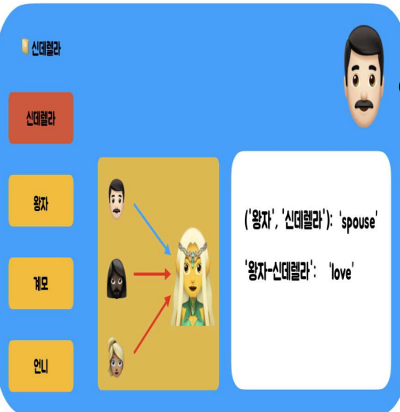

# Relationship Extraction Application using RoBERTa and Sentiment Analysis Datasets
## Introduction
- Pre-Trained RoBERTa를 이용하여 입력문장들에 대해서 관계를 추출하는 방식
- 2개의 PreTrained Model을 사용
  -  Sentimental Analysis (AI Hub Dataset)
  -  Relationship (KLUE Relationship Dataset)
    
It utilizes sentiment analysis datasets for training and employs state-of-the-art deep learning techniques for accurate relationship extraction.


## Technologies Used
- Linux: Ubuntu or any Linux distribution for development environment.
- TensorFlow: Deep learning framework for implementing and training RoBERTa models.
- SwiftUI: Framework for building the user interface of the application.
- Data Preprocessing 

  
## Features
- ```Utilizes RoBERTa model for relationship extraction in input sentences.```
- Translate ```If there are multiple input sentences, assign weights to the emotions between the sentences and output the final result```
- Supports various types of relationships extraction including familial, professional, and personal relationships.
- Provides interactive user interface designed with SwiftUI for ease of use.
- Offers seamless integration with sentiment analysis datasets for model training and evaluation.

## Results

Input Sequences : 신데렐라 이야기의 문장들을 입력을 받으면, 해당문장들에서 관계를 추출한 후 이를 Visualization
<p>
  
</p>
